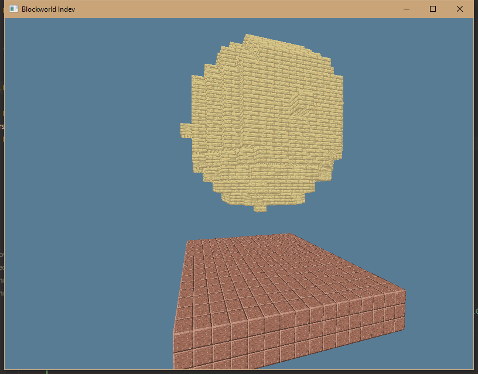

The development is still in progress.

We won't give up this project but the maintainer is busy at another project recently.

# Blockworld

(Currently Indev & Not Playable)

TL;DR:
Blockworld is a modern **Minecraft (Java Version) implementation** which has better performance,
and minecraft modders can easily port their mods into this minecraft implementation.

## Todo List (2024-08-21):
- Graphics
  * [ ] Antialias
  * [ ] Ambient Occlusion
  * [ ] Mipmap
  * [ ] Shader
- Engine
  * [ ] ECS Engine
  * [ ] Command Parser
  * [ ] Script Language
  * [ ] Atlas Generator
  * [ ] GUI System
  * [ ] Save File (De)serialization
  * [ ] Map Generation

## Contributing

We basically organize the code based on the same structure as minecraft. And keep the code extremely clean and readable.

Every big module will contain a `README.md` file to explain the purpose of the module.

It's different from rust's module documentation, which the readme is more like a brief introduction to the motivation of the module, in order to attract more contributors.

## What does Blockworld do
- Provide better minecraft experience for players.
- Modular design, which means you can use Blockworld as a voxel game engine. Official updates will be provide like a mod (1.20 mod etc.)
- Provide easy api to mod the game.
- Looks like minecraft. So it's not like what minetest did.
- No code obfuscation: everyone can modify the source code.
- Port your minecraft world into Blockworld easily.
- Fix some major bugs in minecraft. However some bugs which is useful(like quasi-connection) won't be deleted.
- **Multi-threading.**
- Cross-platform.
- Based on Minecraft 1.16
- Be able to write mods in WASM.

## What doesn't Blockworld do
- Use the same data format(like named binary tag) as minecraft. However we will provide a converter
- Reimplement every detail of minecraft.
- Follow the offical update of minecraft. We think the content of 1.12.2 is enough. But the content of higher version of minecraft may be maintained by mods.

## Current Progress:

## Minecraft is Dying

Minecraft, as a popular game, has been loved for many years.
Its huge community created plenty of various mods and gameplay.
Ironically, mojang seems not to know that not everybody likes their tedious updates -- axolotls, suspicious sands, wolves. Do we really need them?
Isn't mods like _Create_ better than offical updates? 
Minecraft **should** be like lego bricks, like a playground, like a game framework, rather than a boring RPG game.
If it has to be a RPG game, it should be done by **mods** like _twilight forest_.

That's why I decided to make a new minecraft, which is suckless.

Our goal is giving the ability of making new gameplays.
